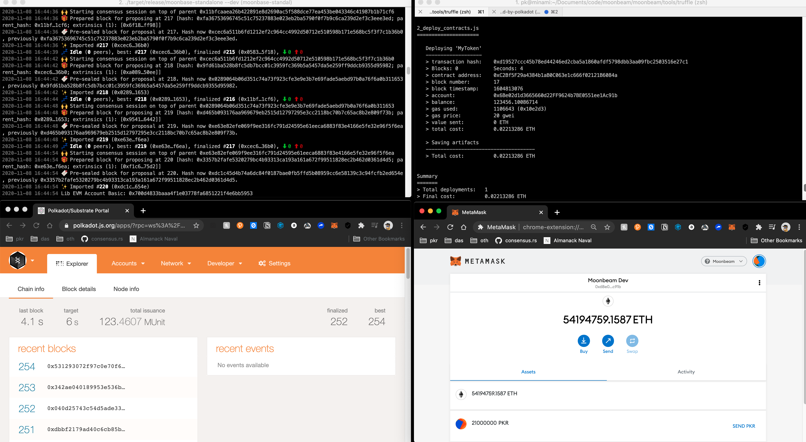

## Challenge: Deploy On Moonbase Alpha Using Truffle

https://gitcoin.co/issue/PureStake/gitcoin-hello-world-by-moonbeam/1/100023953

## Solution



### Steps

- build and run a standalone node in dev mode
- edit and compile ERC20 solidity contract
- deploy the compliled contract


### Outputs

```
❯ node_modules/.bin/truffle compile

Compiling your contracts...
===========================
> Compiling ./contracts/MyToken.sol
> Compiling @openzeppelin/contracts/GSN/Context.sol
> Compiling @openzeppelin/contracts/math/SafeMath.sol
> Compiling @openzeppelin/contracts/token/ERC20/ERC20.sol
> Compiling @openzeppelin/contracts/token/ERC20/ERC20Detailed.sol
> Compiling @openzeppelin/contracts/token/ERC20/IERC20.sol
> Artifacts written to /Users/pk/Documents/code/moonbeam/moonbeam/tools/truffle/build/contracts
> Compiled successfully using:
   - solc: 0.5.16+commit.9c3226ce.Emscripten.clang
```

```
❯ node_modules/.bin/truffle migrate --network development

Compiling your contracts...
===========================
> Everything is up to date, there is nothing to compile.

Starting migrations...
======================
> Network name:    'development'
> Network id:      43
> Block gas limit: 0 (0x0)

2_deploy_contracts.js
=====================

   Deploying 'MyToken'
   -------------------
   > transaction hash:    0xd19527ccc45b78ed44246ed2cba5a1860afdf5798dbb3aa09fbc2503516e27c1
   > Blocks: 0            Seconds: 4
   > contract address:    0xC2Bf5F29a4384b1aB0C063e1c666f02121B6084a
   > block number:        17
   > block timestamp:     1604813076
   > account:             0x6Be02d1d3665660d22FF9624b7BE0551ee1Ac91b
   > balance:             123456.10086714
   > gas used:            1106643 (0x10e2d3)
   > gas price:           20 gwei
   > value sent:          0 ETH
   > total cost:          0.02213286 ETH

   > Saving artifacts
   -------------------------------------
   > Total cost:          0.02213286 ETH


Summary
=======
> Total deployments:   1
> Final cost:          0.02213286 ETH
```


### Resources
moonbeam https://github.com/PureStake/moonbeam
