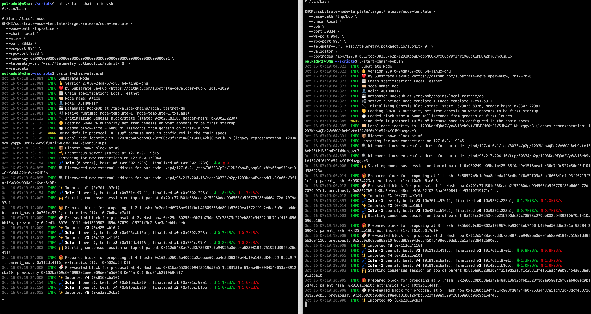

## Challenge: Run A Private Substrate Network

https://gitcoin.co/issue/Polkadot-Network/hello-world-by-polkadot/16/100023942

## Solution

### Repo

https://github.com/pkrasam/hello-world-by-polkadot/tree/main/16

### Resources

https://substrate.dev/docs/en/tutorials/start-a-private-network/
