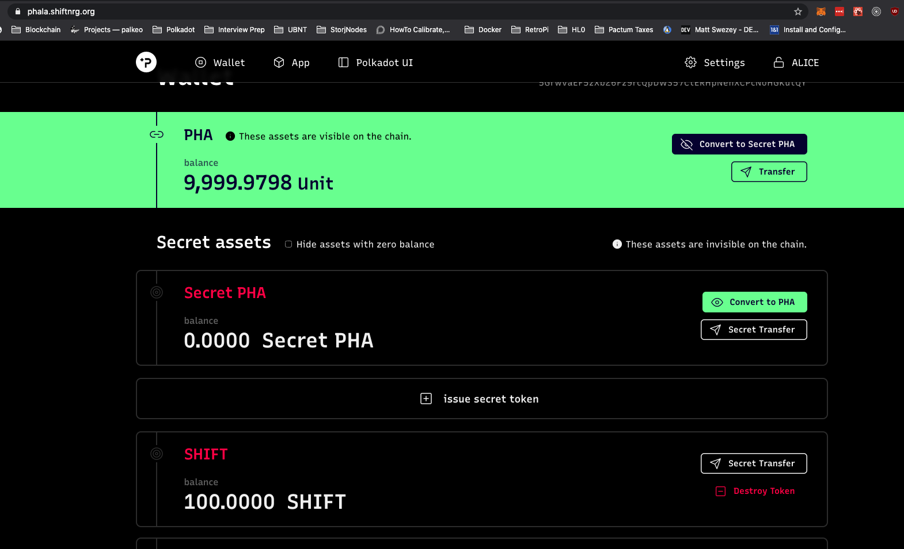
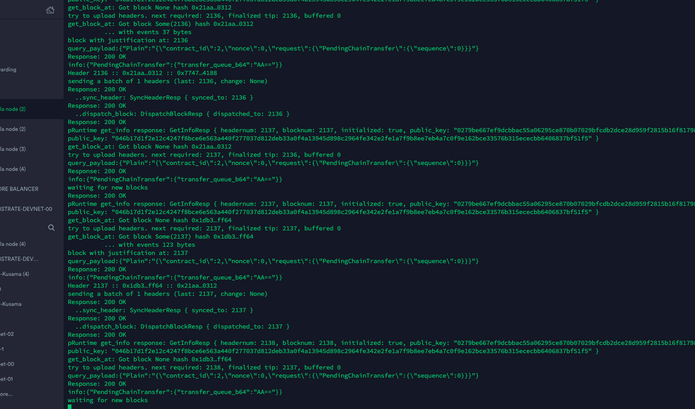
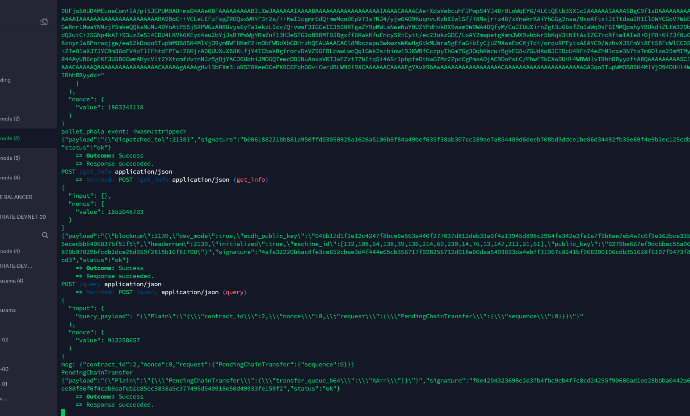
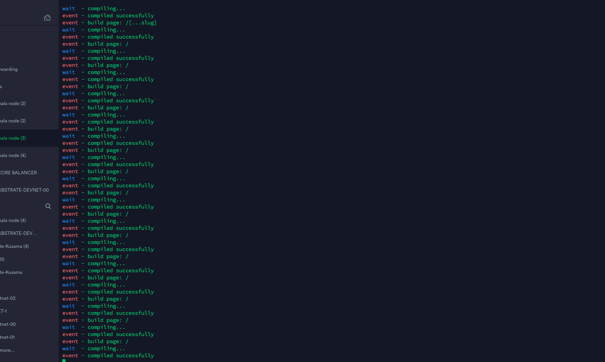
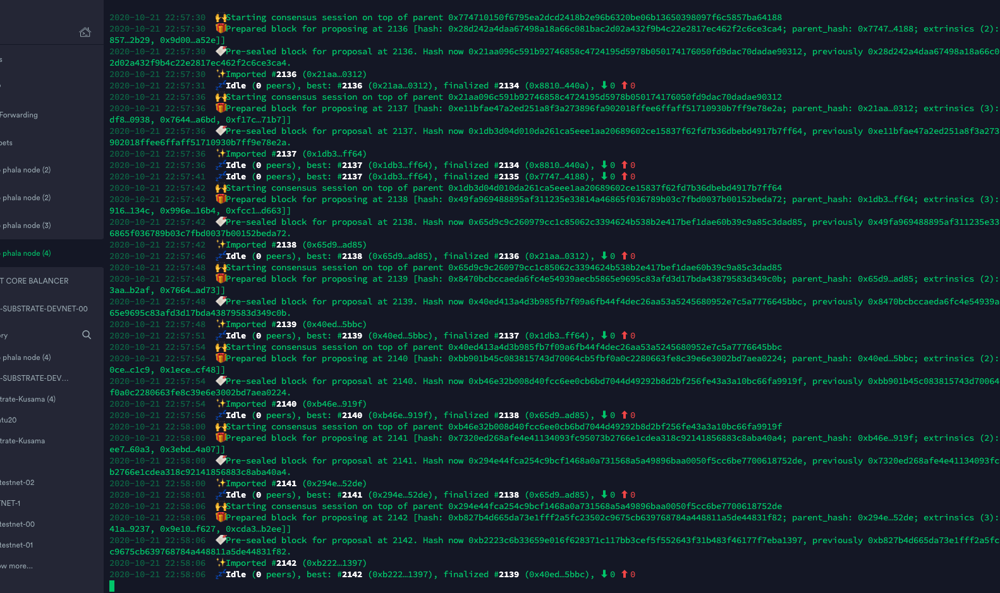

# Challenge
* [ECOSYSTEM CHALLENGE] (Beginner) Build and Run a Local Phala Network
* https://gitcoin.co/issue/Phala-Network/hello-world-by-polkadot/1/100023945
* Issue: https://github.com/Phala-Network/hello-world-by-polkadot/issues/1

## Hosted on a t3.large aws spot instance w/ ha proxy with HTTPS ON!

# Screenshots

