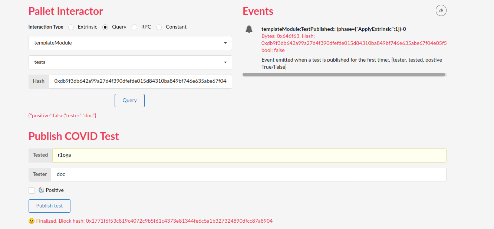

# Hackathon: Hello World! by Polkadot
## [INTERMEDIATE CHALLENGE] FRAME Development


### Getting started
- In `/substrate-node-template`:  
  ```
  WASM_BUILD_TOOLCHAIN=nightly-2020-10-05 cargo run -- --dev --tmp
  ```
- In `/substrate-front-end-template`:  
  ```
  yarn install && yarn start  
  ```

